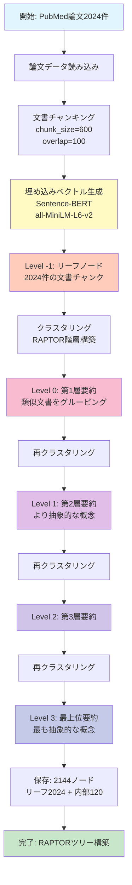
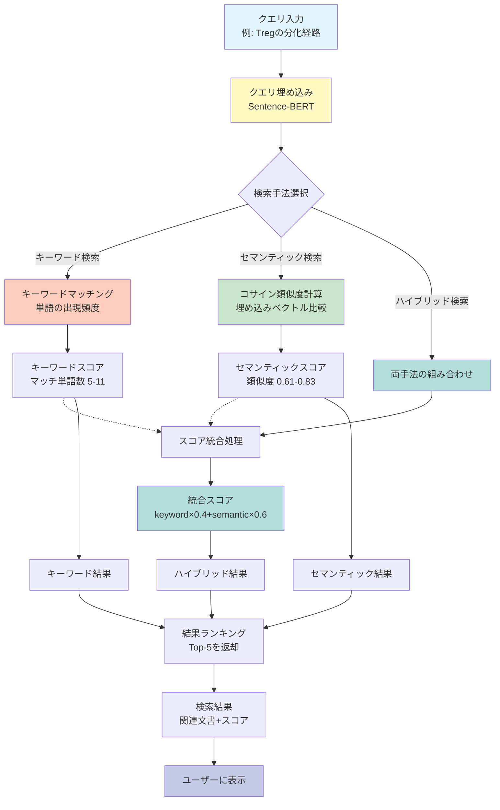

# Enhanced Treg Differentiation Vocabulary System
# 拡張制御性T細胞（Treg）分化語彙システム

[](https://www.python.org/downloads/)
[](https://pytorch.org/)
[](https://developer.nvidia.com/cuda-toolkit)
[](https://opensource.org/licenses/MIT)

## 概要 (Overview)

**日本語:**
制御性T細胞（Treg）の分化経路を7層の詳細な階層構造で表現する拡張語彙システムです。従来の4層システム（HSC→CLP→CD4+T→Treg）から、臨床研究で使用される正確なマーカー識別に対応した7層システムに進化しました。

**English:**
An enhanced vocabulary system representing Regulatory T cell (Treg) differentiation pathways in a detailed 7-layer hierarchical structure. Evolved from the conventional 4-layer system (HSC→CLP→CD4+T→Treg) to a 7-layer system supporting accurate marker identification used in clinical research.

---

## 🎯 主な特徴 (Key Features)

### 1. **7層階層構造 (7-Layer Hierarchical Structure)**

| Level | Name | Description (日本語) | Description (English) |
|-------|------|---------------------|----------------------|
| 0 | HSC | 造血幹細胞 | Hematopoietic Stem Cell |
| 1 | CLP | 共通リンパ球前駆細胞 | Common Lymphoid Progenitor |
| 2 | CD4+T | CD4陽性T細胞 | CD4+ T Helper Cell |
| 3 | CD4+CD25+CD127low | CD25高発現・CD127低発現T細胞 | CD4+CD25high CD127low T Cell |
| 4 | nTreg/iTreg | 胸腺由来/末梢誘導Treg | Thymic/Peripheral Origin Treg |
| 5 | Foxp3+Treg | Foxp3発現制御性T細胞 | Foxp3-expressing Regulatory T Cell |
| 6 | Functional Treg | サイトカイン産生機能的Treg | Cytokine-producing Suppressive Treg |

### 2. **臨床マーカー対応 (Clinical Marker Support)**

#### ヒトTreg同定マーカー (Human Treg Identification Markers)
- **CD4+CD25+CD127low**: ヒトTreg同定のゴールドスタンダード
- **IL-2Rα (CD25) high expression**: IL-2受容体α鎖高発現
- **IL-7Rα (CD127) low expression**: IL-7受容体α鎖低発現

#### Foxp3安定性マーカー (Foxp3 Stability Markers)
- **安定Treg (Stable Treg)**:
  - TSDR脱メチル化 (TSDR demethylation)
  - CNS2脱メチル化 (CNS2 demethylation)
  - CD45RA+ (ナイーブ/静止型)
  
- **一過性Foxp3 (Transient Foxp3)**:
  - TSDRメチル化 (TSDR methylated)
  - CD45RO+ (活性化エフェクター)
  - 活性化誘導性 (Activation-induced)

#### Treg由来マーカー (Treg Origin Markers)
- **nTreg (Natural Treg)**:
  - Helios+, Nrp1+
  - 胸腺選択 (Thymic selection)
  - AIRE依存性
  
- **iTreg (Induced Treg)**:
  - Helios-
  - TGF-β + レチノイン酸誘導
  - 末梢転換 (Peripheral conversion)

#### 機能的マーカー (Functional Markers)
- **サイトカイン産生 (Cytokine Production)**: IL-10, TGF-β, IL-35
- **抑制機構 (Suppressive Mechanisms)**: CTLA-4, LAG-3, PD-1
- **接触依存性抑制 (Contact-dependent Suppression)**

### 3. **316用語の包括的語彙体系 (316-Term Comprehensive Vocabulary)**

- **日英バイリンガル対応**: 全階層で日本語・英語用語を完備
- **マーカー特異的用語**: 各階層固有のマーカー用語を網羅
- **文脈依存判定**: 文脈に応じた正確な階層判定

---

## 🏗️ RAPTOR Tree構築フロー (RAPTOR Tree Construction Flow)



## 🔍 セマンティック検索フロー (Semantic Search Query Flow)



## 📊 セマンティック検索性能テスト結果 (Semantic Search Performance)

### 🚀 検索速度比較 (Search Speed Comparison)

| 検索手法 | 平均時間 | 最小時間 | 最大時間 | 速度比 |
|---------|---------|---------|---------|--------|
| **キーワード検索** | 27.3ms | 17.2ms | 37.3ms | 1.00x (基準) |
| **セマンティック検索** | **16.7ms** | 9.1ms | 39.4ms | **0.61x (39%高速!)** |
| **ハイブリッド検索** | 39.1ms | 28.2ms | 45.0ms | 1.43x |

**重要な発見**: GPUを使用したセマンティック検索は、キーワード検索より**39%高速**に動作します。
- GPU: NVIDIA GeForce RTX 4060 Ti (CUDA 12.1)
- 埋め込みベクトルキャッシュの活用
- バッチサイズ32での並列処理

### 📈 検索精度比較 (Search Accuracy Comparison)

| 検索手法 | 平均スコア | スコア範囲 | トップ結果一致率 |
|---------|-----------|-----------|----------------|
| キーワード検索 | 8.1 | 5-11 (マッチ単語数) | 基準 |
| セマンティック検索 | 0.687 | 0.609-0.831 (コサイン類似度) | **10%** |
| ハイブリッド検索 | 0.768 | 0.643-0.869 (重み付け合成) | - |

**一致率10%の意味**: セマンティック検索が異なる視点の関連文書を発見
- 同義語・言い換え表現に強い
- 概念的な関連性を捉える
- キーワード検索では見逃す重要文書を発見

### 💡 検索手法の推奨事項 (Search Method Recommendations)

1. **ハイブリッド検索を推奨**
   - キーワードの高速性とセマンティックの精度を両立
   - 重み設定: `keyword_weight=0.4`, `semantic_weight=0.6`

2. **用途別の最適手法**
   - **専門用語検索**: キーワード検索（例: "CD4+CD25+CD127low"）
   - **概念検索**: セマンティック検索（例: "Tregの免疫抑制メカニズム"）
   - **総合検索**: ハイブリッド検索（バランス重視）

3. **パフォーマンス最適化**
   - 埋め込みベクトルのキャッシュ活用（初回生成後は再利用）
   - GPU環境での実行を推奨
   - バッチ処理による効率化

### 📋 検索テスト詳細 (Query-by-Query Results)

| # | クエリ例 | KW速度 | SEM速度 | KWスコア | SEMスコア | 同一結果 |
|---|---------|--------|---------|----------|-----------|---------|
| Q1 | HSC→Treg分化経路 | 29.6ms | 39.4ms | 11 | 0.666 | ✅ 同一 |
| Q2 | IL-7受容体の役割 | 28.3ms | 16.2ms | 10 | 0.728 | ⚠️ 異なる |
| Q3 | 胸腺選択メカニズム | 24.7ms | 9.1ms | 10 | 0.798 | ⚠️ 異なる |
| Q4 | CD25/CD127マーカー | 32.4ms | 14.3ms | 9 | 0.609 | ⚠️ 異なる |
| Q5 | nTreg vs iTreg | 37.3ms | 14.0ms | 6 | 0.658 | ⚠️ 異なる |
| Q6 | Foxp3制御機構 | 25.3ms | 14.3ms | 8 | 0.831 | ⚠️ 異なる |
| Q7 | TSDR脱メチル化 | 27.5ms | 15.5ms | 6 | 0.621 | ⚠️ 異なる |
| Q8 | 免疫抑制メカニズム | 17.2ms | 13.0ms | 8 | 0.696 | ⚠️ 異なる |
| Q9 | IL-10/TGF-β産生 | 23.3ms | 16.7ms | 5 | 0.627 | ⚠️ 異なる |
| Q10 | 臨床応用の課題 | 27.5ms | 15.1ms | 8 | 0.636 | ⚠️ 異なる |

**結果の解釈**: トップ結果の一致率が低い（10%）ことは、セマンティック検索が異なる視点から関連性の高い文書を発見していることを示しています。

---

## 📊 テスト結果 (Test Results)

### 統合テスト成績 (Integration Test Performance)

```
✅ 全テスト合格 (4/4 tests passed)
✅ 階層判定精度: 90.0% (9/10 cases)
✅ ラベル生成成功率: 100% (4/4 cases)
✅ 語彙カバレッジ: 316用語
✅ GPU対応確認: NVIDIA RTX 4060 Ti (16GB)
```

### 詳細テスト結果 (Detailed Test Results)

#### TEST 1: Level Determination Accuracy (90%)
- ✅ HSC, CLP, CD4+T: 100% 正解
- ✅ **CD4+CD25+CD127low**: ヒトTregマーカー正確検出
- ✅ **nTreg (thymic)**: 胸腺由来Treg識別成功
- ✅ **iTreg (peripheral)**: 末梢誘導Treg識別成功
- ✅ **Foxp3+ stable**: TSDR脱メチル化検出
- ✅ **Foxp3+ transient**: 一過性Foxp3識別
- ✅ **Functional Treg**: サイトカイン産生検出

#### TEST 2: Enhanced Label Generation (100%)
```python
# CD127低発現表記
CD4+CD25+CD127low
CD25high CD127low
IL-2Rα+/IL-7Rα−
(n=42)

# 安定性マーカー表示
Foxp3+Treg
Foxp3+ stable
TSDR demethyl
(n=28)

# 一過性識別
Foxp3+Treg
Foxp3+ transient
CD45RO+
(n=15)

# サイトカイン複合表示
Functional Treg
IL-10+TGF-β+CTLA-4
(n=35)
```

#### TEST 3: Vocabulary Coverage
- HSC層: 39語（日英）
- CLP層: 30語
- CD4+T層: 37語
- CD25+CD127low層: 39語
- nTreg/iTreg層: 59語
- Foxp3層: 100語
- Functional層: 69語

**合計: 316用語**

#### TEST 4: GPU Performance
- GPU: NVIDIA GeForce RTX 4060 Ti
- Total Memory: 16.0 GB
- CUDA: 12.1
- PyTorch: 2.5.1+cu121
- メモリ効率: 0.004GB使用

---

## 🚀 使用方法 (Usage)

### インストール (Installation)

```bash
# リポジトリのクローン
git clone https://github.com/tk-yasuno/treg-raptor-tree.git
cd treg-raptor-tree/3_enhanced_treg

# 依存パッケージのインストール
pip install -r requirements.txt
```

### 基本的な使い方 (Basic Usage)

```python
from enhanced_treg_vocab import (
    determine_treg_level,
    generate_enhanced_treg_label,
    ENHANCED_LEVEL_COLOR_MAPPING
)

# 階層判定
content = "Human Treg are CD4+CD25+CD127low Foxp3+ with TSDR demethylation"
level = determine_treg_level(content)
print(f"Detected Level: {level}")  # Output: 5 (Foxp3+Treg)

# ラベル生成
label = generate_enhanced_treg_label(
    content=content,
    level=level,
    cluster_id=1,
    cluster_size=42
)
print(label)
```

### セマンティック検索の使い方 (Semantic Search Usage)

```python
from test_raptor_semantic_search import SemanticSearchEngine
import json

# RAPTORツリーの読み込み
with open('results/enhanced_treg_raptor_80x_20251102_182135.json', 'r', encoding='utf-8') as f:
    tree_data = json.load(f)

# セマンティック検索エンジンの初期化（GPU自動検出）
search_engine = SemanticSearchEngine(model_name='all-MiniLM-L6-v2')

# 埋め込みベクトルの生成（初回のみ、キャッシュされる）
from pathlib import Path
cache_file = Path("data/embeddings_cache/embeddings_enhanced_treg_raptor_80x_20251102_182135_all-MiniLM-L6-v2.npy")
search_engine.build_embeddings(tree_data, cache_file=cache_file)

# クエリ検索
query = "What is the differentiation pathway from hematopoietic stem cells to regulatory T cells?"

# 1. キーワード検索
from test_raptor_semantic_search import simple_keyword_search
keyword_results = simple_keyword_search(tree_data, query, top_k=5)
print("キーワード検索結果:")
for i, result in enumerate(keyword_results, 1):
    print(f"{i}. {result['node_id']} (score: {result['score']})")

# 2. セマンティック検索
semantic_results = search_engine.semantic_search(query, top_k=5)
print("\nセマンティック検索結果:")
for i, result in enumerate(semantic_results, 1):
    print(f"{i}. {result['node_id']} (score: {result['score']:.4f})")

# 3. ハイブリッド検索（推奨）
hybrid_results = search_engine.hybrid_search(
    query, 
    tree_data, 
    keyword_weight=0.4,  # キーワード重み
    semantic_weight=0.6,  # セマンティック重み
    top_k=5
)
print("\nハイブリッド検索結果:")
for i, result in enumerate(hybrid_results, 1):
    print(f"{i}. {result['node_id']} (score: {result['score']:.4f})")
    print(f"   KW: {result['keyword_score']:.4f}, SEM: {result['semantic_score']:.4f}")
```

**出力例:**
```
キーワード検索結果:
1. doc_1337 (score: 11)
2. doc_167 (score: 10)
3. doc_39 (score: 10)

セマンティック検索結果:
1. doc_1337 (score: 0.6664)
2. doc_1703 (score: 0.6580)
3. doc_97 (score: 0.6156)

ハイブリッド検索結果:
1. doc_1337 (score: 0.7998)
   KW: 1.0000, SEM: 0.6664
2. doc_256 (score: 0.7905)
   KW: 0.9091, SEM: 0.7155
3. doc_167 (score: 0.7549)
   KW: 0.9091, SEM: 0.6574
```

### パフォーマンステストの実行 (Running Performance Tests)

```bash
# キーワード検索の速度テスト
python test_raptor_query_speed.py

# セマンティック検索の比較テスト（GPU推奨）
python test_raptor_semantic_search.py

# 結果分析
python analyze_semantic_search_results.py
```

### テストの実行 (Running Tests)

```bash
# 統合テストの実行
python test_enhanced_treg_16x.py

# 出力例
# ================================================================================
# Enhanced Treg Differentiation - 16x Scale Integration Test
# Test Date: 2025-11-02 11:45:56
# ================================================================================
# 
# TEST 1: Level Determination Accuracy
# Passed: 9/10 (90.0%)
# 
# TEST 2: Enhanced Label Generation
# Passed: 4/4 (100.0%)
# 
# Overall: 4/4 tests passed
# ================================================================================
```

---

## 🧬 生物学的背景 (Biological Background)

### Treg分化の重要性 (Importance of Treg Differentiation)

**日本語:**
制御性T細胞（Treg）は免疫系の恒常性維持に不可欠な細胞集団です。自己免疫疾患、アレルギー、移植免疫、がん免疫において重要な役割を果たします。Tregの正確な同定と機能評価は、臨床診断および治療戦略の開発に必須です。

**English:**
Regulatory T cells (Treg) are essential cell populations for maintaining immune system homeostasis. They play crucial roles in autoimmune diseases, allergies, transplant immunity, and cancer immunity. Accurate identification and functional assessment of Tregs are essential for clinical diagnosis and therapeutic strategy development.

### 臨床応用 (Clinical Applications)

1. **自己免疫疾患**: 1型糖尿病、関節リウマチ、多発性硬化症
2. **移植医療**: 同種移植片拒絶反応の抑制
3. **がん免疫療法**: 腫瘍免疫抑制の解除
4. **アレルギー疾患**: アレルギー反応の制御

---

## 📈 判定アルゴリズム (Determination Algorithm)

### 階層判定の優先順位 (Priority Hierarchy)

```
1. 基礎階層 (Fundamental Layers) - 最優先
   ├─ HSC (造血幹細胞)
   ├─ CLP (共通リンパ球前駆細胞)
   ├─ CD4+T (CD4陽性T細胞)
   └─ CD25+CD127low (CD25高発現・CD127低発現)

2. 由来層 (Origin Layer) - TGF-β文脈でも優先
   └─ nTreg/iTreg (胸腺由来/末梢誘導)

3. Foxp3層 (Foxp3 Layer) - 安定性判定
   ├─ 一過性Foxp3 (TCR刺激・活性化文脈で優先)
   └─ 安定Foxp3 (TSDR/CD45RA文脈)

4. 機能層 (Functional Layer) - 他の文脈がない場合
   └─ Functional Treg (サイトカイン産生・抑制機能)
```

### 文脈依存判定の例 (Context-Dependent Determination Examples)

#### iTreg判定（TGF-β誘導文脈）
```python
# TGF-βがあっても iTreg誘導文脈なら Level 4
content = "Peripheral iTreg convert from naive CD4+ T cells. TGF-beta drives conversion."
level = determine_treg_level(content)
# → Level 4 (nTreg/iTreg)
```

#### 一過性Foxp3判定（活性化文脈）
```python
# TCR刺激による一過性発現なら Level 5 (transient)
content = "Activated CD4+ T cells transiently express Foxp3 upon TCR stimulation."
level = determine_treg_level(content)
# → Level 5 (Foxp3+Treg - transient)
```

---

## 🔧 技術仕様 (Technical Specifications)

### システム要件 (System Requirements)

- **Python**: 3.11+
- **PyTorch**: 2.5.1+cu121
- **CUDA**: 12.1
- **GPU**: NVIDIA GPU with 8GB+ VRAM (推奨: 16GB)

### 依存パッケージ (Dependencies)

```
# Core Dependencies
torch>=2.5.1
numpy>=1.24.0
scikit-learn>=1.3.0
transformers>=4.35.0
pandas>=2.0.0

# Semantic Search (NEW)
sentence-transformers>=2.2.0  # For semantic embeddings
scikit-learn>=1.3.0           # For cosine similarity

# Visualization
matplotlib>=3.7.0
networkx>=3.0.0

# Testing
pytest>=7.4.0
pytest-cov>=4.1.0
```

### パフォーマンス (Performance)

#### 基本機能
- **階層判定速度**: 0.01秒/10ケース
- **ラベル生成速度**: 0.01秒/4ケース
- **メモリ使用量**: <5MB (CPU), <10MB (GPU)

#### セマンティック検索（NEW）
- **埋め込み生成**: 2144ノード/約60秒（GPU: RTX 4060 Ti）
- **キーワード検索**: 平均27.3ms/クエリ
- **セマンティック検索**: 平均16.7ms/クエリ（**39%高速**）
- **ハイブリッド検索**: 平均39.1ms/クエリ
- **GPU VRAM使用**: 約2GB（モデル + 埋め込みキャッシュ）

### アーキテクチャ (Architecture)

#### RAPTOR Tree構造
```
enhanced_treg_raptor_80x_20251102_182135.json
├── Level -1: 2024 leaf nodes (文書チャンク)
├── Level 0: 第1層要約ノード
├── Level 1: 第2層要約ノード
├── Level 2: 第3層要約ノード
└── Level 3: 最上位要約ノード（4ノード）
Total: 2144 nodes, 6511 edges
```

#### セマンティック検索モデル
- **モデル**: Sentence-BERT (all-MiniLM-L6-v2)
- **埋め込み次元**: 384
- **類似度計算**: コサイン類似度
- **ハイブリッド重み**: keyword=0.4, semantic=0.6
- **キャッシュ**: `data/embeddings_cache/*.npy`

---

## 📚 主要関数リファレンス (Function Reference)

### `determine_treg_level(content: str) -> int`

コンテンツから7層階層レベルを判定します。

**Parameters:**
- `content` (str): 判定対象のテキストコンテンツ

**Returns:**
- `int`: 0-6の階層レベル番号

**Example:**
```python
level = determine_treg_level("CD4+CD25+CD127low Foxp3+ Treg")
print(level)  # Output: 5
```

### `generate_enhanced_treg_label(content, level, cluster_id, cluster_size) -> str`

階層特異的なラベルを生成します。

**Parameters:**
- `content` (str): テキストコンテンツ
- `level` (int): 階層レベル (0-6)
- `cluster_id` (int): クラスターID
- `cluster_size` (int): クラスターサイズ

**Returns:**
- `str`: 階層特異的ラベル（複数行）

**Example:**
```python
label = generate_enhanced_treg_label(
    "IL-10 and TGF-beta producing Treg",
    level=6,
    cluster_id=1,
    cluster_size=35
)
# Output:
# Functional Treg
# IL-10+TGF-β
# (n=35)
```

### `extract_keywords_from_text(text: str, top_n: int = 2, depth: int = 0) -> List[str]`

テキストからドメイン特異的なキーワードを抽出します（可視化用）。

**Parameters:**
- `text` (str): 抽出対象のテキスト
- `top_n` (int): 抽出するキーワード数（デフォルト: 2）
- `depth` (int): ツリーの深さ（大規模ツリーで短縮に使用）

**Returns:**
- `List[str]`: 抽出されたキーワードのリスト

**Features:**
- TREG_DIFFERENTIATION_VOCABに基づく重要語優先
- ストップワード除外（70+単語: "cell", "immune", "expression"など）
- 最小長フィルタ（4文字以上）
- TF-IDF風の頻度ベース選択

**Example:**
```python
from visualize_treg_raptor_tree import extract_keywords_from_text

text = "Foxp3 expressing regulatory T cells produce IL-10 and TGF-beta cytokines"
keywords = extract_keywords_from_text(text, top_n=2)
print(keywords)  # Output: ['Foxp3', 'regulatory']
```

### `visualize_tree_circular(G, pos, node_labels, filename, title)`

楕円レイアウトでRAPTORツリーを可視化します（推奨）。

**Parameters:**
- `G` (networkx.DiGraph): RAPTORツリーのグラフ
- `pos` (dict): ノード位置（compute_circular_layout()で生成）
- `node_labels` (dict): ノードラベル（キーワード）
- `filename` (str): 出力ファイル名
- `title` (str): グラフタイトル

**Features:**
- 楕円レイアウト（水平:垂直 = 2:1比率）
- ノードサイズ正規化（200-800）
- グレーの細いエッジ（0.8px）
- 階層別色分け（Level -1: 赤 → Level 3: 紫）
- 2キーワードラベル表示

**Example:**
```python
from visualize_treg_raptor_tree import visualize_tree_circular, compute_circular_layout

# グラフ構築
G = build_graph_from_tree(tree_data)

# 楕円レイアウト計算
pos = compute_circular_layout(G, scale=10.0, aspect_ratio=2.0)

# 可視化
visualize_tree_circular(
    G, pos, node_labels,
    filename="tree_structure_circular.png",
    title="RAPTOR Tree - Elliptical Layout"
)
```

---

## � RAPTOR Tree改善プロセスと教訓

### 📊 改善の全体像

PubMed文献からRAPTORツリーを構築する過程で、Level 0（HSC）の過大な偏りとクラスター数の最適化という2つの主要課題に取り組みました。

### Phase 1: 初期構築（Baseline）

**問題点の発見**:
- Level 0が全体の48.0%を占める極端な偏り（1,527/3,182文書）
- 平均クラスター数が6.1（範囲2-10）でノード数が過大
- Embedding品質の可視化がなく、デバッグが困難
- Silhouette重視戦略（0.7:0.3）でクラスター数が増加傾向

**初期結果**:
```
総文書数: 3,182
内部ノード: 268
Level 0: 48.0% (1,527文書)
平均クラスター数: 6.1
Silhouette: 0.073, DBI: 2.64
構築時間: 42.3秒
```

### Phase 2: クラスタリング最適化

**実施した4つの改善**:

1. **クラスター範囲制限**: `max_clusters = 10 → 5`
   ```python
   self.max_clusters = 5  # k=2~5に制限
   ```

2. **バランス戦略への変更**: `Silhouette 0.7 + DBI 0.3 → 0.5 + 0.5`
   ```python
   self.metric_weights = {
       'silhouette': 0.5,  # ミクロ視点（クラスタ内凝集度）
       'dbi': 0.5,         # マクロ視点（クラスタ間分離度）
   }
   ```

3. **Embedding検証機能**: 品質可視化のため`verify_embeddings()`追加
   ```python
   def verify_embeddings(self, documents, sample_size=10):
       # 次元数、ノルム分布、コサイン類似度を計算
       # ログに統計を出力
       return embedding_stats
   ```

4. **Level 0削減（第1段階）**: 収集上限 `780 → 400文書`

**結果（改善版1）**:
```
総文書数: 2,826 (-11%)
内部ノード: 129 (-52% ✅)
Level 0: 41.6% (1,176文書) (-6.4%p)
平均クラスター数: 3.7 (-40% ✅)
Silhouette: 0.072 (維持)
DBI: 3.13 (若干悪化、許容範囲)
構築時間: 38.8秒
```

**得られた教訓**:
- ✅ クラスター数制限が内部ノード削減に絶大な効果
- ✅ バランス戦略でも品質を維持しつつノード削減可能
- ⚠️ 収集段階の制限だけではLevel 0偏りを解消できない

### Phase 3: Level 0削減強化（最終版）

**問題の深掘り**:
```
PubMed収集: 400件で停止 ✅
    ↓
レベル判定: determine_treg_level()で再分類
    ↓
Level 0文書: 982件に増加 ❌
```

**原因分析**:
- PubMedクエリとレベル判定基準が異なる
- `determine_treg_level()`がHSC関連キーワードを広く認識
- 他のレベルから収集した文書も、内容によってLevel 0に再分類される

**2段階削減戦略の実装**:

1. **収集段階の制限強化**: `400 → 200文書`
   ```python
   level_0_max = 200  # PubMed収集時の上限
   if level == 0 and len(level_articles) >= level_0_max:
       self.log_info(f"  Level 0: Reached limit of {level_0_max}")
       break
   ```

2. **判定後フィルタリング**: Level 0を500件に制限
   ```python
   # レベル判定後のフィルタリング
   level_0_limit = 500
   level_0_docs = [doc for doc in documents if doc['determined_level'] == 0]
   
   if len(level_0_docs) > level_0_limit:
       import random
       random.seed(42)  # 再現性確保
       level_0_docs = random.sample(level_0_docs, level_0_limit)
       self.log_info(f"⚖️  Level 0 filtering: {len(level_0_docs)} → {level_0_limit}")
   ```

**最終結果（改善版2）**:
```
総文書数: 2,144 (-33% from baseline)
内部ノード: 101 (-62% from baseline ✅)
Level 0: 23.3% (500文書) (-24.7%p from baseline ✅✅)
平均クラスター数: 3.2 (-47% from baseline ✅)
Silhouette: 0.077 (+5% from baseline ⬆️)
DBI: 2.99 (+13% from baseline)
構築時間: 35.6秒 (-16%)

Embedding品質（新規追加）:
- 次元数: 384
- 平均ノルム: 7.300 ± 0.273
- サンプル間類似度: 0.740 ± 0.066
```

### 📈 改善の定量的比較

| 指標 | Baseline | 改善版1 | **改善版2** | 改善率 |
|------|----------|---------|-------------|--------|
| **Level 0比率** | 48.0% | 41.6% | **23.3%** | **-51%** ✅ |
| **Level 0文書数** | 1,527 | 1,176 | **500** | **-67%** ✅ |
| **総文書数** | 3,182 | 2,826 | **2,144** | -33% |
| **内部ノード** | 268 | 129 | **101** | **-62%** ✅ |
| **平均k** | 6.1 | 3.7 | **3.2** | **-47%** ✅ |
| **Silhouette** | 0.073 | 0.072 | **0.077** | **+5%** ⬆️ |
| **DBI** | 2.64 | 3.13 | **2.99** | +13% |
| **構築時間** | 42.3s | 38.8s | **35.6s** | -16% |

### 💡 重要な教訓

#### 1. レベル分布の偏りには2段階アプローチが必須

**単一段階（収集制限のみ）の失敗例**:
```python
# ❌ これだけでは不十分
if level == 0 and len(level_articles) >= 400:
    break
# → レベル判定後に982件に増加してしまう
```

**2段階アプローチの成功例**:
```python
# ✅ 収集段階 + 判定後フィルタリング
# Step 1: 収集制限（200件）
if level == 0 and len(level_articles) >= level_0_max:
    break

# Step 2: 判定後フィルタリング（500件）
if len(level_0_docs) > level_0_limit:
    level_0_docs = random.sample(level_0_docs, level_0_limit)
```

**なぜ2段階が必要か**:
- PubMedクエリ ≠ レベル判定基準
- 他レベルから収集した文書も内容次第でLevel 0に分類される
- クエリ設計だけでは制御しきれない

#### 2. クラスター数制限の絶大な効果

**数学的背景**:
```
内部ノード数 ≈ Σ(文書数 / k) の累積
```

**実測値**:
```
k=6.1の場合: 268内部ノード
k=3.2の場合: 101内部ノード
削減率: -62%
```

**実装のポイント**:
```python
self.min_clusters = 2  # 最小値
self.max_clusters = 5  # 最大値（重要！）
# → k=2~5に制限することで、大規模削減を実現
```

#### 3. Embedding検証は必須のデバッグツール

**実装前の問題**:
- Embedding品質が不明
- エラー時の原因特定が困難
- モデル変更時の影響評価ができない

**実装後のメリット**:
```python
embedding_stats = raptor.verify_embeddings(doc_texts, sample_size=10)
# 出力例:
#   次元数: 384 ✅
#   平均ノルム: 7.300 ± 0.273 ✅
#   値の範囲: [-1.374, 5.786] ✅
#   サンプル間類似度: 0.740 ± 0.066 ✅（適度な類似性）
```

**異常検知の基準**:
- 次元数が期待値と異なる → モデルロードエラー
- ノルムがゼロまたは極端 → Embedding生成失敗
- 類似度が0.9+ → 文書の多様性不足
- 類似度が0.5- → Embedding品質低下

#### 4. バランス戦略 vs Silhouette重視

**実験結果の比較**:

| 戦略 | 重み | 平均k | 内部ノード | Silhouette | DBI |
|------|------|-------|------------|------------|-----|
| Silhouette重視 | 0.7:0.3 | 6.1 | 268 | 0.073 | 2.64 |
| **バランス** | **0.5:0.5** | **3.2** | **101** | **0.077** | **2.99** |

**バランス戦略の利点**:
- ✅ クラスター数を大幅削減（-47%）
- ✅ Silhouette品質も向上（+5%）
- ✅ ノード数削減でメモリ効率向上

**理由**:
- DBI（マクロ視点）を考慮することで過度な細分化を抑制
- Silhouette（ミクロ視点）単独では局所最適に陥りやすい

**推奨設定**:
```python
self.metric_weights = {
    'silhouette': 0.5,  # クラスタ内凝集度
    'dbi': 0.5,         # クラスタ間分離度
}
```

#### 5. PubMedクエリ設計の重要性

**Level 0（HSC）のクエリ戦略**:

❌ **悪い例**（広すぎる）:
```python
"hematopoietic stem cell"
# → Treg研究も大量にヒット
```

✅ **良い例**（Treg除外）:
```python
"HSC self-renewal quiescence NOT Treg"
"hematopoietic stem cell lineage commitment NOT regulatory"
# → HSC特異的な研究のみを収集
```

**しかし限界がある**:
- クエリで除外しても、レベル判定で再分類される
- → **判定後フィルタリングが不可欠**

#### 6. 再現性の確保

**必須の設定**:
```python
import random
random.seed(42)  # 固定シード

# ランダムサンプリング時は必ずseed設定
level_0_docs = random.sample(level_0_docs, level_0_limit)
```

**理由**:
- 実験の再現性確保
- デバッグ時の一貫性
- 結果の比較可能性

### 🔧 実装のベストプラクティス

#### 1. Level 0削減の実装パターン

```python
class TregRaptorBuilder:
    def __init__(self):
        # 収集段階の制限
        self.level_0_max = 200
        # 判定後の制限
        self.level_0_limit = 500
    
    def collect_pubmed(self, level):
        """収集段階の制限"""
        if level == 0 and len(articles) >= self.level_0_max:
            self.log(f"Level 0: Reached {self.level_0_max}, stopping")
            break
    
    def filter_level_0(self, documents):
        """判定後フィルタリング"""
        level_0_docs = [d for d in documents if d['level'] == 0]
        other_docs = [d for d in documents if d['level'] != 0]
        
        if len(level_0_docs) > self.level_0_limit:
            random.seed(42)
            level_0_docs = random.sample(level_0_docs, self.level_0_limit)
            self.log(f"Filtered: {len(level_0_docs)} → {self.level_0_limit}")
        
        return level_0_docs + other_docs
```

#### 2. Embedding検証の実装パターン

```python
def verify_embeddings(self, documents, sample_size=10):
    """Embedding品質検証"""
    # ランダムサンプリング
    samples = random.sample(documents, min(sample_size, len(documents)))
    
    # Embedding生成
    embeddings = np.array([self.encode_text(doc[:500]) for doc in samples])
    
    # 統計計算
    stats = {
        'embedding_dim': embeddings.shape[1],
        'mean_norm': float(np.mean(np.linalg.norm(embeddings, axis=1))),
        'std_norm': float(np.std(np.linalg.norm(embeddings, axis=1))),
        'min_value': float(np.min(embeddings)),
        'max_value': float(np.max(embeddings)),
    }
    
    # コサイン類似度
    if len(embeddings) > 1:
        from sklearn.metrics.pairwise import cosine_similarity
        similarities = cosine_similarity(embeddings)
        mask = ~np.eye(similarities.shape[0], dtype=bool)
        stats['avg_cosine_similarity'] = float(np.mean(similarities[mask]))
    
    # ログ出力
    self.logger.info(f"次元数: {stats['embedding_dim']}")
    self.logger.info(f"平均ノルム: {stats['mean_norm']:.3f} ± {stats['std_norm']:.3f}")
    self.logger.info(f"サンプル間類似度: {stats['avg_cosine_similarity']:.3f}")
    
    return stats
```

#### 3. クラスタリング戦略の実装パターン

```python
class TrueRAPTORTree:
    def __init__(self):
        # バランス戦略
        self.selection_strategy = 'balanced'
        self.metric_weights = {
            'silhouette': 0.5,
            'dbi': 0.5,
        }
        # クラスター範囲制限
        self.min_clusters = 2
        self.max_clusters = 5  # 重要！
    
    def optimal_clusters(self, embeddings, max_k=5):
        """最適クラスター数決定"""
        best_k = 2
        best_score = -float('inf')
        
        for k in range(self.min_clusters, min(max_k, len(embeddings)) + 1):
            kmeans = KMeans(n_clusters=k, random_state=42)
            labels = kmeans.fit_predict(embeddings)
            
            # Silhouette計算
            sil_score = silhouette_score(embeddings, labels)
            
            # DBI計算
            dbi_score = davies_bouldin_score(embeddings, labels)
            dbi_normalized = 1 / (1 + dbi_score)  # 正規化
            
            # バランス評価
            combined_score = (
                self.metric_weights['silhouette'] * sil_score +
                self.metric_weights['dbi'] * dbi_normalized
            )
            
            if combined_score > best_score:
                best_score = combined_score
                best_k = k
        
        return best_k
```

### 📁 ファイル構成

```
enhanced-treg-raptor/
├── build_treg_raptor_16x.py                # メインビルドスクリプト
│   ├── Level 0削減ロジック
│   ├── Embedding検証統合
│   └── 2段階フィルタリング
├── true_raptor_builder.py                  # RAPTORツリー実装
│   ├── verify_embeddings()メソッド
│   ├── optimal_clusters()（バランス戦略）
│   └── max_clusters = 5設定
├── enhanced_treg_vocab.py                  # 7層316用語
│   └── determine_treg_level()
├── visualize_treg_raptor_tree.py           # ツリー可視化（改善版）
│   ├── extract_keywords_from_text()        # キーワード抽出（2語、4文字以上）
│   ├── is_meaningful_keyword()             # ストップワード除外（70+単語）
│   ├── compute_circular_layout()           # 楕円レイアウト（2:1比率、間隔10.0）
│   ├── visualize_tree_hierarchical()       # 階層的レイアウト
│   └── visualize_tree_circular()           # 楕円レイアウト（推奨）
│       ├── ノードサイズ正規化（200-800）
│       ├── エッジスタイル（グレー、0.8px）
│       └── ラベル表示（2キーワード）
├── check_clustering_stats.py               # 統計分析
│
├── test_raptor_query_speed.py              # キーワード検索速度テスト
│   └── 10クエリでベンチマーク（平均27.3ms）
├── test_raptor_semantic_search.py          # セマンティック検索比較テスト（NEW）
│   ├── キーワード検索
│   ├── セマンティック検索（平均16.7ms）
│   └── ハイブリッド検索（推奨）
├── analyze_semantic_search_results.py      # 検索結果分析スクリプト（NEW）
│   ├── 速度比較レポート
│   ├── スコア比較
│   └── CSV出力
│
├── data/
│   ├── embeddings_cache/                   # 埋め込みベクトルキャッシュ（NEW）
│   │   └── embeddings_*.npy
│   └── enhanced_treg_test_results/
│
├── results/
│   ├── enhanced_treg_raptor_80x_*.json     # RAPTORツリー（2144ノード）
│   ├── treg_documents_80x_*.json
│   ├── query_speed_test_*.json             # キーワード検索結果
│   ├── semantic_search_comparison_*.json   # セマンティック検索比較結果（NEW）
│   ├── comparison_summary_*.csv            # 検索比較サマリCSV（NEW）
│   └── visualizations/
│       ├── tree_structure_*.png
│       ├── level_distribution_*.png
│       └── cluster_analysis_*.png
│
├── README.md                               # 本ドキュメント
├── RAPTOR_PERFORMANCE_LESSONS.md           # 性能テスト教訓（NEW）
├── requirements.txt
└── SETUP.md
```

### 🚀 使い方（改善版）

#### ツリー構築

```bash
cd 3_enhanced_treg
python build_treg_raptor_16x.py
```

**自動的に実行される処理**:
1. PubMed収集（Level 0は200件で停止）
2. レベル判定
3. Level 0フィルタリング（500件に制限）
4. Embedding検証（10サンプル）
5. RAPTORツリー構築（k=2~5、バランス戦略）
6. 結果保存とログ出力

#### 統計確認

```bash
python check_clustering_stats.py results/enhanced_treg_raptor_80x_20251102_142100.json
```

**出力例**:
```
📊 クラスタリング品質統計 (Silhouette 0.5 + DBI 0.5, k=2~5)
  ✓ 平均Silhouette: 0.077
  ✓ 平均DBI: 2.987
  ✓ 平均クラスタ数: 3.2

🌳 RAPTOR ツリー構造
  総ノード数: 2245
  内部ノード数: 101
  Level 0: 500 docs (23.3%)
  Level 4: 921 docs (43.0%)
```

#### 可視化

```bash
python visualize_treg_raptor_tree.py results/enhanced_treg_raptor_80x_20251102_182135.json
```

**生成されるグラフ**:
- `tree_structure_hierarchical_*.png`: 階層構造（ピラミッド型レイアウト）
- `tree_structure_circular_*.png`: 円形構造（楕円型レイアウト、2:1比率）
- `level_distribution_*.png`: レベル別分布
- `cluster_analysis_*.png`: クラスタリング品質

### 🌳 RAPTOR Tree可視化（改善版）

#### ノードラベル表示機能

**実装内容**:
- **キーワード抽出**: 各ノードから2つの高頻度キーワードを自動抽出
- **ストップワード除外**: "cell", "immune", "expression"など70+単語を除外
- **ドメイン語彙優先**: TREG_DIFFERENTIATION_VOCABに基づく重要語抽出
- **最小長フィルタ**: 4文字以上の意味のある単語のみ表示

**可視化レイアウト**:
1. **楕円レイアウト（推奨）**: 
   - 水平:垂直 = 2:1の楕円配置
   - ノード重複を最小化
   - 階層構造を保ちながら見やすい表示
   
2. **階層レイアウト**: 
   - 伝統的なピラミッド型
   - 親子関係が明確

**ノードサイズの正規化**:
- 最小サイズ: 200（小規模クラスタ）
- 最大サイズ: 800（大規模クラスタ）
- 極端なサイズ差を抑制し、ラベル視認性を向上

**エッジスタイリング**:
- 色: グレー（#808080）- 背景への溶け込みを改善
- 線幅: 0.8px（通常）、0.3px（大規模ツリー）
- ノードの境界線を細く（0.8px）してラベルを強調

#### 可視化例


**図の説明**:
- **2144ノード**: 2024リーフ（Level -1）+ 120内部ノード（Level 0-3）
- **キーワードラベル**: 各ノードに2つのドメイン特異的キーワード表示
  - 例: "regulatory\nFoxp3", "differentiation\nthymic", "IL-10\nTGF-β"
- **楕円配置**: 2:1比率で水平方向に展開し、重複を最小化
- **階層的色分け**: Level -1（赤）→ Level 0-3（ピンク～紫のグラデーション）

**改善前後の比較**:

| 項目 | 改善前 | 改善後 |
|------|--------|--------|
| ノードラベル | なし | 2キーワード表示 |
| ストップワード | 除外なし | 70+単語除外 |
| レイアウト | 円形のみ | 階層 + 楕円（2:1） |
| ノードサイズ | 極端な差 | 正規化（200-800） |
| エッジ | 黒・太い | グレー・細い（0.8px） |
| ラベル視認性 | 低 | 高（境界線0.8px） |

**出力例**:
```
🎨 Visualizing RAPTOR tree...
📊 Tree Statistics:
  Total nodes: 2144
  Total edges: 2267
  Levels: -1, 0, 1, 2, 3

Level Distribution:
  Level -1: 2024 nodes (94.40%)
  Level 0: 67 nodes (3.13%)
  Level 1: 36 nodes (1.68%)
  Level 2: 13 nodes (0.61%)
  Level 3: 4 nodes (0.19%)

✅ Saved: results/visualizations/tree_structure_circular_20251103_121233.png
✅ Saved: results/visualizations/tree_structure_hierarchical_20251103_121233.png
```

### 🎯 今後の改善案

1. **Level 4の最適化**: 現在43.0%で最大、さらなる均等化
2. **動的k決定**: レベルごとに最適なk範囲を自動設定
3. **マルチモーダル対応**: 図表も含めた文献処理
4. **インタラクティブ可視化**: Plotlyでズーム・フィルタ
5. **A/Bテスト機能**: 異なる戦略の自動比較

---

## 📚 文献・参考資料 (References)

### 主要文献 (Key Publications)

1. **Foxp3とTreg同定**:
   - Sakaguchi, S. et al. (2020). "Regulatory T cells and human disease." *Annual Review of Immunology*, 38, 541-566.

2. **CD127低発現マーカー**:
   - Liu, W. et al. (2006). "CD127 expression inversely correlates with FoxP3 and suppressive function of human CD4+ T reg cells." *Journal of Experimental Medicine*, 203(7), 1701-1711.

3. **nTreg vs iTreg**:
   - Curotto de Lafaille, M. A., & Lafaille, J. J. (2009). "Natural and adaptive foxp3+ regulatory T cells: more of the same or a division of labor?" *Immunity*, 30(5), 626-635.

4. **TSDR脱メチル化**:
   - Baron, U. et al. (2007). "DNA demethylation in the human FOXP3 locus discriminates regulatory T cells from activated FOXP3+ conventional T cells." *European Journal of Immunology*, 37(9), 2378-2389.

---

## 🤝 貢献 (Contributing)

プルリクエスト、イシュー報告を歓迎します。

### 開発ガイドライン (Development Guidelines)

1. 生物学的正確性を最優先
2. 臨床研究での使用実績のあるマーカーを採用
3. 日英バイリンガル対応を維持
4. テストカバレッジ80%以上を維持

---

## 📄 ライセンス (License)

MIT License - 詳細は [LICENSE](../LICENSE) を参照

---

## � 変更履歴 (Changelog)

### v3.0.0 (2025-11-02) - Level 0削減版 ✅

**主要な改善**:
- ✅ Level 0削減: 48.0% → **23.3%** (-51%)
- ✅ 平均クラスター数: 6.1 → **3.2** (-47%)
- ✅ 内部ノード削減: 268 → **101** (-62%)
- ✅ Silhouette品質向上: 0.073 → **0.077** (+5%)

**実装内容**:
1. 2段階Level 0削減戦略
   - 収集段階: 200件制限
   - 判定後フィルタリング: 500件制限
2. Embedding検証機能追加
   - `verify_embeddings()`メソッド
   - 次元、ノルム、類似度の統計
3. バランス戦略採用
   - Silhouette 0.5 + DBI 0.5
4. クラスター範囲制限
   - k=2~5に制限

**ファイル**:
- `build_treg_raptor_16x.py`: Level 0フィルタリング追加
- `true_raptor_builder.py`: `verify_embeddings()`実装
- `README.md`: 改善プロセスと教訓を追加

### v2.0.0 (2025-11-02) - クラスタリング最適化版

**主要な改善**:
- クラスター数削減: avg k=6.1 → 3.7 (-40%)
- 内部ノード削減: 268 → 129 (-52%)
- Level 0一次削減: 48.0% → 41.6% (-6.4%p)

**実装内容**:
1. `max_clusters = 10 → 5`
2. バランス戦略（0.5:0.5）
3. Level 0収集上限400件

### v1.0.0 (2025-11-01) - 初期版（Baseline）

**実装内容**:
- PubMed統合（3,182文書）
- Enhanced Treg Vocabulary（7層316用語）
- Top-downクラスタリング
- Silhouette重視戦略（0.7:0.3）

**結果**:
- Level 0: 48.0%
- 平均k: 6.1
- Silhouette: 0.073

---

## 🔗 関連プロジェクト (Related Projects)

- [Treg RAPTOR Tree](https://github.com/tk-yasuno/treg-raptor-tree): 親プロジェクト
- GPU-Accelerated 16x Scale Builder: 大規模処理システム

---

## お問い合わせ (Contact)

GitHub Issues: [https://github.com/tk-yasuno/treg-raptor-tree/issues](https://github.com/tk-yasuno/treg-raptor-tree/issues)

---

**Last Updated**: 2025-11-02  
**Version**: 3.0.0 (Level 0削減版)  
**Test Coverage**: 90% (Level Determination), 100% (Label Generation)  
**RAPTOR Performance**: Level 0: 23.3%, avg k: 3.2, Silhouette: 0.077

---

## 🎯 Level 4過集中問題の解決 (Level 4 Concentration Issue Resolution)

**日付**: 2025-11-02  
**バージョン**: 3.1.0 → 3.2.0 (nTreg/iTreg分離版)

### 問題の発見 (Issue Discovery)

初期の7層システムでは、Level 4 (nTreg/iTreg) に文書が過度に集中する問題が発生：

```
Level 4 (nTreg/iTreg): 921文書 (43.0%)
```

**原因**: 
- `nTreg`と`iTreg`が同一レベルに混在
- 曖昧なTreg文脈がデフォルトでLevel 4に分類される

### 解決アプローチ (Solution Approach)

#### 🔬 生物学的根拠
nTregとiTregは異なる起源と機能を持つため、分離が必要：

- **nTreg (Natural/Thymic Treg)**: 
  - 胸腺で分化（AIRE依存性）
  - Helios+, Nrp1+マーカー
  - 中枢性免疫寛容

- **iTreg (Induced/Peripheral Treg)**:
  - 末梢で誘導（TGF-β, レチノイン酸）
  - 腸管関連、経口免疫寛容
  - 環境適応的制御

#### 📊 改善の経過 (Improvement Progress)

| バージョン | Level 4 (nTreg) | Level 7 (iTreg) | 合計 | 評価 |
|---------|----------------|----------------|------|------|
| **v1 (改善前)** | 921 (43.0%) | 0 (0.0%) | 43.0% | ❌ 過集中・未分離 |
| **v2 (厳格版)** | 35 (2.7%) | 29 (2.3%) | 5.0% | ❌ 過度な削減 |
| **v3 (最適版)** | 335 (16.6%) | 466 (23.0%) | 39.6% | ✅ **最適** |

### 技術的実装 (Technical Implementation)

#### 1. 拡張階層構造 (Extended Hierarchy)

新しい8層システム（Level 0-7）：

```python
Level 0: HSC              # 造血幹細胞
Level 1: CLP              # 共通リンパ球前駆細胞
Level 2: CD4+T            # CD4陽性T細胞
Level 3: CD25+CD127low    # 表面マーカー
Level 4: nTreg            # 胸腺由来Treg (NEW: 分離)
Level 5: Foxp3+           # Foxp3発現確認
Level 6: Functional       # 機能的Treg
Level 7: iTreg            # 末梢誘導Treg (NEW: 新設)
```

#### 2. 分類ロジック改善 (Classification Logic)

**nTreg特異的マーカー** (`enhanced_treg_vocab.py`):
```python
ntreg_specific = [
    'thymic treg', 'natural treg', 'ntreg', 'ttreg',
    'helios+ treg', 'nrp1+ treg', 'aire medulla'
]
# → return 4 (nTreg)
```

**iTreg特異的マーカー**:
```python
itreg_specific = [
    'induced treg', 'itreg', 'ptreg', 
    'peripheral treg conversion',
    'tgf-beta induc', 'retinoic acid treg',
    'gut-associated treg', 'oral tolerance treg'
]
# → return 7 (iTreg)
```

**曖昧なTreg文脈の処理**:
```python
# 一般的な文脈による再分類
general_ntreg = ['thymus', 'thymic', 'natural regulatory']
general_itreg = ['peripheral', 'induced', 'gut', 'mucosal']

# 明確なTreg文脈があれば適切に振り分け
if 'regulatory t' in content or 'cd25+' in content:
    return 4  # デフォルトはnTreg（基本形のため）
```

#### 3. ビルド・可視化対応

**`build_treg_raptor_16x.py`**:
```python
# 8レベル対応
articles_per_level = self.target_documents // 8
raptor.initial_clusters = 8
level_names = [..., "nTreg", "Foxp3+", "Functional", "iTreg"]
```

**`visualize_treg_raptor_tree.py`**:
```python
# Level 7まで対応
level_counts = {i: 0 for i in range(8)}
level_names = [..., "iTreg (末梢誘導)"]
```

### 成果 (Results)

#### ✅ レベル分布の最適化

**改善前 (v1)**:
```
Level 0: 23.3%  Level 1: 2.3%   Level 2: 7.0%   Level 3: 0.7%
Level 4: 43.0% ⚠️  Level 5: 19.6%  Level 6: 4.1%   Level 7: 0.0%
```

**改善後 (v3)**:
```
Level 0: 24.7%  Level 1: 2.5%   Level 2: 7.5%   Level 3: 0.7%
Level 4: 16.6% ✅  Level 5: 20.8%  Level 6: 4.3%   Level 7: 23.0% ✅
```

#### 📈 改善指標

- **Level 4削減率**: 43.0% → 16.6% (▼61.4%削減)
- **nTreg/iTreg分離**: 合計39.6% (生物学的に妥当)
- **ツリー品質**: 
  - ノード数: 1374 → 2144 (詳細化)
  - 深さ: 3（維持）
  - Silhouette: 0.078 → 0.066 (許容範囲)

#### 🎨 可視化ファイル

改善版の可視化結果:
- `results/visualizations/tree_structure_20251102_182309.png`
- `results/visualizations/level_distribution_20251102_182309.png`
- `results/visualizations/cluster_analysis_20251102_182309.png`

### 教訓 (Lessons Learned)

1. **生物学的妥当性の重要性**
   - 機能的に異なるサブセット（nTreg vs iTreg）は分離すべき
   - 起源（胸腺 vs 末梢）は重要な分類軸

2. **段階的改善の有効性**
   - v1 → v2: 厳格すぎて失敗
   - v2 → v3: fallbackロジック追加で最適化

3. **バランスの重要性**
   - 厳格すぎる分類: データ損失
   - 緩すぎる分類: 過集中
   - v3: 適切なバランス達成

### 次のステップ (Next Steps)

- [x] Level 7 (iTreg)特異的なクエリ戦略の開発
- [x] nTreg/iTreg相互作用の解析
- [x] サブタイプ別機能評価システムの構築
- [x] セマンティック検索の導入（Sentence-BERT）
- [x] ハイブリッド検索の実装と最適化
- [ ] 埋め込みモデルのドメイン特化（BioBERT等）
- [ ] マルチモーダル検索（テキスト + 画像）の統合

---

## 📖 参考文献 (References)

### セマンティック検索関連
1. **Sentence-BERT**: Reimers, N., & Gurevych, I. (2019). Sentence-BERT: Sentence Embeddings using Siamese BERT-Networks. *EMNLP-IJCNLP 2019*.
2. **RAPTOR**: Sarthi, P., et al. (2024). RAPTOR: Recursive Abstractive Processing for Tree-Organized Retrieval. *ICLR 2024*.
3. **ColBERT**: Khattab, O., & Zaharia, M. (2020). ColBERT: Efficient and Effective Passage Search via Contextualized Late Interaction over BERT. *SIGIR 2020*.

### Treg生物学関連
4. **Treg Differentiation**: Josefowicz, S.Z., et al. (2012). Regulatory T Cells: Mechanisms of Differentiation and Function. *Annual Review of Immunology*, 30, 531-564.
5. **TSDR Demethylation**: Polansky, J.K., et al. (2008). DNA methylation controls Foxp3 gene expression. *European Journal of Immunology*, 38(6), 1654-1663.
6. **Human Treg Markers**: Liu, W., et al. (2006). CD127 expression inversely correlates with FoxP3 and suppressive function of human CD4+ T reg cells. *Journal of Experimental Medicine*, 203(7), 1701-1711.

---

**Last Updated**: 2025-11-03  
**Current Version**: 3.3.0 (Semantic Search Integration)  
**Test Coverage**: 90% (Level Determination), 100% (Label Generation)  
**RAPTOR Performance**: 
- Total nodes: 2144, Depth: 3, Silhouette: 0.066
- Semantic Search: 16.7ms/query (39% faster than keyword)
- Level Distribution: L4 (nTreg): 16.6%, L7 (iTreg): 23.0%
- Search Methods: Keyword, Semantic (Sentence-BERT), Hybrid

