# Enhanced Treg Differentiation Vocabulary System

[](https://www.python.org/downloads/)
[](https://pytorch.org/)
[](https://developer.nvidia.com/cuda-toolkit)
[](https://opensource.org/licenses/MIT)

[日本語版 README](README.md) | **English README**

## Overview

An enhanced vocabulary system representing Regulatory T cell (Treg) differentiation pathways in a detailed 7-layer hierarchical structure. This system has evolved from the conventional 4-layer system (HSC→CLP→CD4+T→Treg) to a comprehensive 7-layer framework supporting accurate marker identification used in clinical research.

The system combines domain-specific vocabulary management with GPU-accelerated semantic search capabilities, enabling researchers to efficiently explore Treg differentiation literature through multiple search strategies.

---

## 🎯 Key Features

### 1. **7-Layer Hierarchical Structure**

| Level | Name | Description | Clinical Significance |
|-------|------|-------------|----------------------|
| 0 | HSC | Hematopoietic Stem Cell | Multipotent progenitor cell origin |
| 1 | CLP | Common Lymphoid Progenitor | Lymphoid lineage commitment |
| 2 | CD4+T | CD4+ T Helper Cell | Initial T cell differentiation |
| 3 | CD4+CD25+CD127low | CD25high CD127low T Cell | Human Treg identification gold standard |
| 4 | nTreg/iTreg | Thymic/Peripheral Origin Treg | Distinguishes development pathway |
| 5 | Foxp3+Treg | Foxp3-expressing Regulatory T Cell | Transcription factor-based identification |
| 6 | Functional Treg | Cytokine-producing Suppressive Treg | Functional characterization |

### 2. **Clinical Marker Support**

#### Human Treg Identification Markers
- **CD4+CD25+CD127low**: Gold standard for human Treg identification
  - IL-2Rα (CD25) high expression
  - IL-7Rα (CD127) low expression
  - Superior purity compared to CD4+CD25+ alone

#### Foxp3 Stability Markers
- **Stable Treg**:
  - TSDR (Treg-Specific Demethylated Region) demethylation
  - CNS2 (Conserved Non-coding Sequence 2) demethylation
  - CD45RA+ (naive/resting phenotype)
  - Helios+ (thymic origin marker)
  
- **Transient Foxp3**:
  - TSDR methylated
  - CD45RO+ (activated effector phenotype)
  - Activation-induced expression
  - May lose suppressive function

#### Treg Origin Markers
- **nTreg (Natural/Thymic Treg)**:
  - Helios+, Nrp1+ (Neuropilin-1)
  - AIRE-dependent thymic selection
  - Constitutive Foxp3 expression
  - High suppressive capacity
  
- **iTreg (Induced/Peripheral Treg)**:
  - Helios- (negative marker)
  - TGF-β + retinoic acid induction
  - Peripheral conversion from naive CD4+ T cells
  - Context-dependent stability

#### Functional Markers
- **Cytokine Production**: IL-10, TGF-β, IL-35
- **Suppressive Molecules**: CTLA-4, LAG-3, PD-1, TIGIT
- **Contact-dependent Suppression**: CD39/CD73 adenosine pathway
- **Metabolic Markers**: High CD25, GLUT1 regulation

### 3. **316-Term Comprehensive Vocabulary**

- **Bilingual Support**: Complete Japanese and English terminology across all layers
- **Marker-Specific Terms**: Comprehensive coverage of layer-specific marker terminology
- **Context-Dependent Determination**: Accurate layer assignment based on textual context

---

## 🏗️ RAPTOR Tree Construction Flow


## 🔍 Semantic Search Query Flow

```mermaid
graph TB
    Query["Query Input<br/>Example: Treg differentiation pathway"] --> Embed["Query Embedding<br/>Sentence-BERT"]
    
    Embed --> Split{"Search Method Selection"}
    
    Split -->|Keyword Search| KW["Keyword Matching<br/>Word Frequency"]
    Split -->|Semantic Search| SEM["Cosine Similarity<br/>Embedding Comparison"]
    Split -->|Hybrid Search| HYB["Combined Approach"]
    
    KW --> KWScore["Keyword Score<br/>Match Count 5-11"]
    SEM --> SEMScore["Semantic Score<br/>Similarity 0.61-0.83"]
    
    HYB --> HYBCalc["Score Integration"]
    KWScore -.-> HYBCalc
    SEMScore -.-> HYBCalc
    HYBCalc --> Combine["Combined Score<br/>keyword×0.4+semantic×0.6"]
    
    KWScore --> RankKW["Keyword Results"]
    SEMScore --> RankSEM["Semantic Results"]
    Combine --> RankHYB["Hybrid Results"]
    
    RankKW --> Rank["Result Ranking<br/>Return Top-5"]
    RankSEM --> Rank
    RankHYB --> Rank
    
    Rank --> Results["Search Results<br/>Documents+Scores"]
    
    Results --> Display["Display to User"]
    
    style Query fill:#e1f5ff
    style Embed fill:#fff9c4
    style KW fill:#ffccbc
    style SEM fill:#c8e6c9
    style HYB fill:#b2dfdb
    style Combine fill:#b2dfdb
    style Display fill:#c5cae9
```



## 📊 Semantic Search Performance Test Results

### 🚀 Search Speed Comparison

| Search Method | Avg Time | Min Time | Max Time | Speed Ratio |
|---------------|----------|----------|----------|-------------|
| **Keyword Search** | 27.3ms | 17.2ms | 37.3ms | 1.00x (baseline) |
| **Semantic Search** | **16.7ms** | 9.1ms | 39.4ms | **0.61x (39% faster!)** |
| **Hybrid Search** | 39.1ms | 28.2ms | 45.0ms | 1.43x |

**Key Finding**: GPU-accelerated semantic search is **39% faster** than keyword search.
- GPU: NVIDIA GeForce RTX 4060 Ti (CUDA 12.1)
- Leverages embedding vector cache
- Batch processing with batch_size=32

### 📈 Search Accuracy Comparison

| Search Method | Avg Score | Score Range | Top Result Agreement |
|---------------|-----------|-------------|---------------------|
| Keyword Search | 8.1 | 5-11 (match count) | baseline |
| Semantic Search | 0.687 | 0.609-0.831 (cosine similarity) | **10%** |
| Hybrid Search | 0.768 | 0.643-0.869 (weighted composite) | - |

**10% Agreement Rate Interpretation**: Semantic search discovers different perspectives of relevant documents
- Strong performance with synonyms and paraphrasing
- Captures conceptual relationships
- Finds important documents missed by keyword search

### 💡 Search Method Recommendations

1. **Hybrid Search Recommended**
   - Balances keyword speed and semantic accuracy
   - Weight configuration: `keyword_weight=0.4`, `semantic_weight=0.6`

2. **Use Case-Specific Optimal Methods**
   - **Technical Term Search**: Keyword search (e.g., "CD4+CD25+CD127low")
   - **Concept Search**: Semantic search (e.g., "Treg immunosuppressive mechanisms")
   - **Comprehensive Search**: Hybrid search (balanced approach)

3. **Performance Optimization**
   - Leverage embedding vector cache (reuse after initial generation)
   - GPU environment recommended
   - Efficiency through batch processing

### 📋 Query-by-Query Test Results

| # | Query Example | KW Time | SEM Time | KW Score | SEM Score | Same Top |
|---|---------------|---------|----------|----------|-----------|----------|
| Q1 | HSC to Treg differentiation | 29.6ms | 39.4ms | 11 | 0.666 | ✅ Same |
| Q2 | Role of IL-7 receptor | 28.3ms | 16.2ms | 10 | 0.728 | ⚠️ Different |
| Q3 | Thymic selection mechanism | 24.7ms | 9.1ms | 10 | 0.798 | ⚠️ Different |
| Q4 | CD25/CD127 markers | 32.4ms | 14.3ms | 9 | 0.609 | ⚠️ Different |
| Q5 | nTreg vs iTreg | 37.3ms | 14.0ms | 6 | 0.658 | ⚠️ Different |
| Q6 | Foxp3 regulation | 25.3ms | 14.3ms | 8 | 0.831 | ⚠️ Different |
| Q7 | TSDR demethylation | 27.5ms | 15.5ms | 6 | 0.621 | ⚠️ Different |
| Q8 | Immunosuppression mechanism | 17.2ms | 13.0ms | 8 | 0.696 | ⚠️ Different |
| Q9 | IL-10/TGF-β production | 23.3ms | 16.7ms | 5 | 0.627 | ⚠️ Different |
| Q10 | Clinical application challenges | 27.5ms | 15.1ms | 8 | 0.636 | ⚠️ Different |

**Result Interpretation**: The low top result agreement rate (10%) indicates that semantic search discovers highly relevant documents from different perspectives.

---

## 📊 Test Results

### Integration Test Performance

```
✅ All Tests Passed (4/4 tests)
✅ Layer Determination Accuracy: 90.0% (9/10 cases)
✅ Label Generation Success Rate: 100% (4/4 cases)
✅ Vocabulary Coverage: 316 terms
✅ GPU Support Confirmed: NVIDIA RTX 4060 Ti (16GB)
```

### Detailed Test Results

#### TEST 1: Layer Determination Accuracy (90%)
- ✅ HSC, CLP, CD4+T: 100% correct
- ✅ **CD4+CD25+CD127low**: Human Treg marker accurately detected
- ✅ **nTreg (thymic)**: Thymic-origin Treg successfully identified
- ✅ **iTreg (peripheral)**: Peripherally-induced Treg successfully identified
- ✅ **Foxp3+ stable**: TSDR demethylation detected
- ✅ **Foxp3+ transient**: Transient Foxp3 identified
- ✅ **Functional Treg**: Cytokine production detected

#### TEST 2: Enhanced Label Generation (100%)
```python
# CD127 low expression notation
CD4+CD25+CD127low
CD25high CD127low
IL-2Rα+/IL-7Rα−
(n=42)

# Stability marker display
Foxp3+Treg
Foxp3+ stable
TSDR demethyl
(n=28)

# Transient identification
Foxp3+Treg
Foxp3+ transient
CD45RO+
(n=15)

# Composite cytokine display
Functional Treg
IL-10+TGF-β+CTLA-4
(n=35)
```

#### TEST 3: Vocabulary Coverage
- HSC Layer: 39 terms (bilingual)
- CLP Layer: 30 terms
- CD4+T Layer: 37 terms
- CD25+CD127low Layer: 39 terms
- nTreg/iTreg Layer: 59 terms
- Foxp3 Layer: 100 terms
- Functional Layer: 69 terms

**Total: 316 terms**

#### TEST 4: GPU Performance
- GPU: NVIDIA GeForce RTX 4060 Ti
- Total Memory: 16.0 GB
- CUDA: 12.1
- PyTorch: 2.5.1+cu121
- Memory Efficiency: 0.004GB used

---

## 🚀 Usage

### Installation

```bash
# Clone the repository
git clone https://github.com/tk-yasuno/enhanced-treg-raptor.git
cd enhanced-treg-raptor

# Install dependencies
pip install -r requirements.txt
```

### Basic Usage

```python
from enhanced_treg_vocab import (
    determine_treg_level,
    generate_enhanced_treg_label,
    ENHANCED_LEVEL_COLOR_MAPPING
)

# Layer determination
content = "Human Treg are CD4+CD25+CD127low Foxp3+ with TSDR demethylation"
level = determine_treg_level(content)
print(f"Detected Level: {level}")  # Output: 5 (Foxp3+Treg)

# Label generation
label = generate_enhanced_treg_label(
    content=content,
    level=level,
    cluster_id=1,
    cluster_size=42
)
print(label)
```

### Semantic Search Usage

```python
from test_raptor_semantic_search import SemanticSearchEngine
import json

# Load RAPTOR tree
with open('results/enhanced_treg_raptor_80x_20251102_182135.json', 'r', encoding='utf-8') as f:
    tree_data = json.load(f)

# Initialize semantic search engine (GPU auto-detection)
search_engine = SemanticSearchEngine(model_name='all-MiniLM-L6-v2')

# Build embeddings (first time only, cached afterwards)
from pathlib import Path
cache_file = Path("data/embeddings_cache/embeddings_enhanced_treg_raptor_80x_20251102_182135_all-MiniLM-L6-v2.npy")
search_engine.build_embeddings(tree_data, cache_file=cache_file)

# Query search
query = "What is the differentiation pathway from hematopoietic stem cells to regulatory T cells?"

# 1. Keyword search
from test_raptor_semantic_search import simple_keyword_search
keyword_results = simple_keyword_search(tree_data, query, top_k=5)
print("Keyword Search Results:")
for i, result in enumerate(keyword_results, 1):
    print(f"{i}. {result['node_id']} (score: {result['score']})")

# 2. Semantic search
semantic_results = search_engine.semantic_search(query, top_k=5)
print("\nSemantic Search Results:")
for i, result in enumerate(semantic_results, 1):
    print(f"{i}. {result['node_id']} (score: {result['score']:.4f})")

# 3. Hybrid search (recommended)
hybrid_results = search_engine.hybrid_search(
    query, 
    tree_data, 
    keyword_weight=0.4,  # Keyword weight
    semantic_weight=0.6,  # Semantic weight
    top_k=5
)
print("\nHybrid Search Results:")
for i, result in enumerate(hybrid_results, 1):
    print(f"{i}. {result['node_id']} (score: {result['score']:.4f})")
    print(f"   KW: {result['keyword_score']:.4f}, SEM: {result['semantic_score']:.4f}")
```

**Example Output:**
```
Keyword Search Results:
1. doc_1337 (score: 11)
2. doc_167 (score: 10)
3. doc_39 (score: 10)

Semantic Search Results:
1. doc_1337 (score: 0.6664)
2. doc_1703 (score: 0.6580)
3. doc_97 (score: 0.6156)

Hybrid Search Results:
1. doc_1337 (score: 0.7998)
   KW: 1.0000, SEM: 0.6664
2. doc_256 (score: 0.7905)
   KW: 0.9091, SEM: 0.7155
3. doc_167 (score: 0.7549)
   KW: 0.9091, SEM: 0.6574
```

### Running Performance Tests

```bash
# Keyword search speed test
python test_raptor_query_speed.py

# Semantic search comparison test (GPU recommended)
python test_raptor_semantic_search.py

# Results analysis
python analyze_semantic_search_results.py
```

### Running Tests

```bash
# Run integration tests
python test_enhanced_treg_16x.py

# Example output
# ================================================================================
# Enhanced Treg Differentiation - 16x Scale Integration Test
# Test Date: 2025-11-02 11:45:56
# ================================================================================
# 
# TEST 1: Level Determination Accuracy
# Passed: 9/10 (90.0%)
# 
# TEST 2: Enhanced Label Generation
# Passed: 4/4 (100.0%)
# 
# Overall: 4/4 tests passed
# ================================================================================
```

---

## 🎨 Tree Visualization Improvements

### Node Label Display Features

The RAPTOR tree visualization has been enhanced with domain-specific keyword extraction and improved layout algorithms:

#### Before vs After Comparison

| Feature | Before | After |
|---------|--------|-------|
| **Node Labels** | No labels | 2 keywords per node |
| **Keyword Quality** | N/A | Domain-specific (TREG vocab priority) |
| **Stop Words** | N/A | 70+ words filtered ("cell", "immune", etc.) |
| **Minimum Length** | N/A | 4 characters minimum |
| **Layout** | Circular (overlapping) | Elliptical (2:1 aspect ratio) |
| **Node Size** | Fixed | Normalized (200-800) |
| **Edge Style** | Black, thick | Gray, thin (0.8px) |
| **Level Colors** | Basic | Hierarchical gradient (red→purple) |

#### Visualization Example


**Key Improvements:**
- **Elliptical Layout**: 2:1 horizontal-to-vertical aspect ratio reduces node overlap
- **Keyword Extraction**: Displays 2 most relevant keywords per node from content
- **Stop Word Filtering**: Excludes common words for better label quality
- **Domain Vocabulary Priority**: Treg-specific terms highlighted
- **Hierarchical Colors**: Level -1 (red) → Level 3 (purple) gradient

---

## 🧬 Biological Background

### Importance of Treg Differentiation

Regulatory T cells (Treg) are essential cell populations for maintaining immune system homeostasis. They play crucial roles in:

1. **Autoimmune Disease Prevention**: Suppress self-reactive T cells
2. **Transplant Tolerance**: Prevent graft rejection
3. **Cancer Immunotherapy**: Balance tumor immunity and autoimmunity
4. **Allergic Disease Control**: Regulate allergic responses

Accurate identification and functional assessment of Tregs are essential for clinical diagnosis and therapeutic strategy development.

### Clinical Applications

1. **Autoimmune Diseases**: Type 1 diabetes, rheumatoid arthritis, multiple sclerosis
2. **Transplant Medicine**: Suppression of allograft rejection
3. **Cancer Immunotherapy**: Relieving tumor immunosuppression
4. **Allergic Diseases**: Control of allergic reactions

---

## 📈 Determination Algorithm

### Priority Hierarchy

```
1. Fundamental Layers - Highest Priority
   ├─ HSC (Hematopoietic Stem Cell)
   ├─ CLP (Common Lymphoid Progenitor)
   ├─ CD4+T (CD4+ T Helper Cell)
   └─ CD25+CD127low (CD25high CD127low)

2. Origin Layer - Priority even in TGF-β context
   └─ nTreg/iTreg (Thymic/Peripheral origin)

3. Foxp3 Layer - Stability determination
   ├─ Transient Foxp3 (priority in TCR stimulation/activation context)
   └─ Stable Foxp3 (TSDR/CD45RA context)

4. Functional Layer - When other contexts absent
   └─ Functional Treg (Cytokine production/suppressive function)
```

### Context-Dependent Determination Examples

#### iTreg Determination (TGF-β induction context)
```python
# Even with TGF-β, iTreg induction context → Level 4
content = "Peripheral iTreg convert from naive CD4+ T cells. TGF-beta drives conversion."
level = determine_treg_level(content)
# → Level 4 (nTreg/iTreg)
```

#### Transient Foxp3 Determination (activation context)
```python
# Transient expression by TCR stimulation → Level 5 (transient)
content = "Activated CD4+ T cells transiently express Foxp3 upon TCR stimulation."
level = determine_treg_level(content)
# → Level 5 (Foxp3+Treg - transient)
```

---

## 🔧 Technical Specifications

### System Requirements

- **Python**: 3.11+
- **PyTorch**: 2.5.1+cu121
- **CUDA**: 12.1
- **GPU**: NVIDIA GPU with 8GB+ VRAM (recommended: 16GB)

### Dependencies

```
# Core Dependencies
torch>=2.5.1
numpy>=1.24.0
scikit-learn>=1.3.0
transformers>=4.35.0
pandas>=2.0.0

# Semantic Search
sentence-transformers>=2.2.0  # For semantic embeddings
scikit-learn>=1.3.0           # For cosine similarity

# Visualization
matplotlib>=3.7.0
networkx>=3.0.0

# Testing
pytest>=7.4.0
pytest-cov>=4.1.0
```

### Performance

#### Basic Functions
- **Layer determination speed**: 0.01 seconds/10 cases
- **Label generation speed**: 0.01 seconds/4 cases
- **Memory usage**: <5MB (CPU), <10MB (GPU)

#### Semantic Search
- **Embedding generation**: 2144 nodes/~60 seconds (GPU: RTX 4060 Ti)
- **Keyword search**: Average 27.3ms/query
- **Semantic search**: Average 16.7ms/query (**39% faster**)
- **Hybrid search**: Average 39.1ms/query
- **GPU VRAM usage**: ~2GB (model + embedding cache)

### Architecture

#### RAPTOR Tree Structure
```
enhanced_treg_raptor_80x_20251102_182135.json
├── Level -1: 2024 leaf nodes (document chunks)
├── Level 0: 1st layer summary nodes
├── Level 1: 2nd layer summary nodes
├── Level 2: 3rd layer summary nodes
└── Level 3: Top-level summary nodes (4 nodes)
Total: 2144 nodes, 6511 edges
```

#### Semantic Search Model
- **Model**: Sentence-BERT (all-MiniLM-L6-v2)
- **Embedding Dimension**: 384
- **Similarity Calculation**: Cosine similarity
- **Hybrid Weights**: keyword=0.4, semantic=0.6
- **Cache**: `data/embeddings_cache/*.npy`

---

## 📚 Main Function Reference

### `determine_treg_level(content: str) -> int`

Determines the 7-layer hierarchical level from content.

**Parameters:**
- `content` (str): Text content to analyze

**Returns:**
- `int`: Layer level number (0-6)

**Example:**
```python
level = determine_treg_level("CD4+CD25+CD127low Foxp3+ Treg")
print(level)  # Output: 5
```

### `generate_enhanced_treg_label(content, level, cluster_id, cluster_size) -> str`

Generates layer-specific labels.

**Parameters:**
- `content` (str): Text content
- `level` (int): Layer level (0-6)
- `cluster_id` (int): Cluster ID
- `cluster_size` (int): Cluster size

**Returns:**
- `str`: Layer-specific label (multi-line)

**Example:**
```python
label = generate_enhanced_treg_label(
    "IL-10 and TGF-beta producing Treg",
    level=6,
    cluster_id=1,
    cluster_size=35
)
# Output:
# Functional Treg
# IL-10+TGF-β
# (n=35)
```

### `extract_keywords_from_text(text: str, top_n: int = 2, depth: int = 0) -> List[str]`

Extracts domain-specific keywords from text for visualization.

**Parameters:**
- `text` (str): Text to extract keywords from
- `top_n` (int): Number of keywords to extract (default: 2)
- `depth` (int): Tree depth (used for truncation in large trees)

**Returns:**
- `List[str]`: List of extracted keywords

**Features:**
- Prioritizes terms from TREG_DIFFERENTIATION_VOCAB
- Excludes stop words (70+ words: "cell", "immune", "expression", etc.)
- Minimum length filter (4+ characters)
- TF-IDF-style frequency-based selection

**Example:**
```python
from visualize_treg_raptor_tree import extract_keywords_from_text

text = "Foxp3 expressing regulatory T cells produce IL-10 and TGF-beta cytokines"
keywords = extract_keywords_from_text(text, top_n=2)
print(keywords)  # Output: ['Foxp3', 'regulatory']
```

### `visualize_tree_circular(G, pos, node_labels, filename, title)`

Visualizes RAPTOR tree with elliptical layout (recommended).

**Parameters:**
- `G` (networkx.DiGraph): RAPTOR tree graph
- `pos` (dict): Node positions (generated by compute_circular_layout())
- `node_labels` (dict): Node labels (keywords)
- `filename` (str): Output file name
- `title` (str): Graph title

**Features:**
- Elliptical layout (horizontal:vertical = 2:1 ratio)
- Node size normalization (200-800)
- Gray thin edges (0.8px)
- Level-based coloring (Level -1: red → Level 3: purple)
- 2-keyword label display

**Example:**
```python
from visualize_treg_raptor_tree import visualize_tree_circular, compute_circular_layout

# Build graph
G = build_graph_from_tree(tree_data)

# Compute elliptical layout
pos = compute_circular_layout(G, scale=10.0, aspect_ratio=2.0)

# Visualize
visualize_tree_circular(
    G, pos, node_labels,
    filename="tree_structure_circular.png",
    title="RAPTOR Tree - Elliptical Layout"
)
```

---

## 📁 File Structure

```
enhanced-treg-raptor/
├── README.md                           # Main documentation (Japanese)
├── README_EN.md                        # English documentation
├── STRUCTURE.md                        # Project structure details
├── requirements.txt                    # Python dependencies
│
├── enhanced_treg_vocab.py              # Core vocabulary system
├── enhanced_treg_vocab_v2.py           # Enhanced version
│
├── build_treg_raptor_16x.py            # 16x scale RAPTOR builder
├── true_raptor_builder.py              # True RAPTOR implementation
│
├── visualize_treg_raptor_tree.py       # Tree visualization (NEW)
├── test_raptor_semantic_search.py      # Semantic search engine (NEW)
├── analyze_semantic_search_results.py  # Performance analysis (NEW)
├── test_raptor_query_speed.py          # Speed benchmark (NEW)
│
├── test_enhanced_treg_16x.py           # Integration tests
├── test_level4_fix.py                  # Level 4 validation tests
│
├── data/
│   └── embeddings_cache/               # Cached embeddings (NEW)
│       └── embeddings_*.npy            # Numpy embedding files
│
├── results/
│   ├── enhanced_treg_raptor_80x_20251102_182135.json
│   ├── comparison_summary_20251103_123848.csv  # Performance results (NEW)
│   └── visualizations/                 # Tree visualizations (NEW)
│       ├── tree_structure_circular_*.png
│       ├── tree_structure_hierarchical_*.png
│       ├── cluster_analysis_*.png
│       └── level_distribution_*.png
│
└── pubmed_cache/                       # Cached PubMed articles
    └── articles_*.json
```

---

## 🎓 RAPTOR Tree Improvement Process and Lessons Learned

### 📊 Overall Improvement Overview

During the process of building a RAPTOR tree from PubMed literature, we addressed two major challenges: extreme bias in Level 0 (HSC) and cluster number optimization.

### Phase 1: Initial Construction (Baseline)

**Issues Discovered**:
- Extreme bias with Level 0 accounting for 48.0% (1,527/3,182 documents)
- Average cluster count of 6.1 (range 2-10) leading to excessive nodes
- Lack of embedding quality visualization, making debugging difficult
- Silhouette-focused strategy (0.7:0.3) tending to increase cluster count

### Phase 2: Dynamic Cluster Optimization

**Improvements**:
- BIC-weighted strategy (0.6 BIC + 0.4 Silhouette)
- Dynamic max_clusters adjustment
- L0 bias reduction: 48.0% → 35.6%
- Average cluster: 6.1 → 5.1

### Phase 3: Statistical Distribution Balance

**Advanced Optimization**:
- L0-specific reduced_threshold (0.45)
- Global_max_clusters = 4 setting
- Level bias improvement: 35.6% → 26.3%
- Average cluster: 5.1 → 4.4

### Key Lessons Learned

1. **Embedding Quality Visualization is Essential**
   - UMAP + t-SNE dual approach reveals cluster structure
   - Silhouette score validates natural groupings

2. **Level-Specific Strategy Required**
   - Leaf level (L0) needs stricter cluster limits
   - Higher levels benefit from flexible grouping

3. **BIC Priority is Effective**
   - BIC weight 0.6 prevents over-clustering
   - Maintains balance with Silhouette 0.4

4. **Statistical Balance Achievable**
   - Target: Each level 15-30% of total
   - Achieved through dynamic threshold adjustment

---

## 🤝 Contributing

Contributions are welcome! Please feel free to submit a Pull Request.

1. Fork the repository
2. Create your feature branch (`git checkout -b feature/AmazingFeature`)
3. Commit your changes (`git commit -m 'Add some AmazingFeature'`)
4. Push to the branch (`git push origin feature/AmazingFeature`)
5. Open a Pull Request

---

## 📄 License

This project is licensed under the MIT License - see the LICENSE file for details.

---

## 📧 Contact

- **Author**: Takeshi Yasuno
- **Repository**: https://github.com/tk-yasuno/enhanced-treg-raptor
- **Issues**: https://github.com/tk-yasuno/enhanced-treg-raptor/issues

---

## 🙏 Acknowledgments

- PubMed/NCBI for providing access to biomedical literature
- The RAPTOR framework developers for the hierarchical tree construction methodology
- Sentence-Transformers library for semantic embedding capabilities
- The immunology research community for advancing Treg differentiation knowledge

---

## 📚 References

1. RAPTOR: Recursive Abstractive Processing for Tree-Organized Retrieval
2. Sentence-BERT: Sentence Embeddings using Siamese BERT-Networks
3. Regulatory T Cell Differentiation Pathways (PubMed Literature)
4. Clinical Treg Identification Markers (Human Immunology Research)

---

**Last Updated**: November 3, 2025
